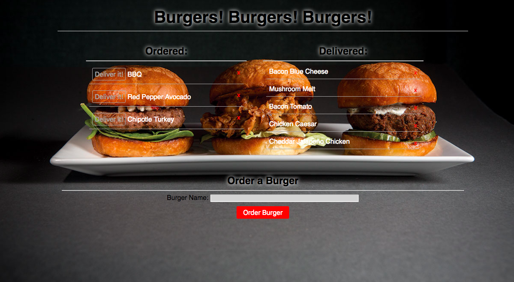

# Burger
Burgers! Burgers! Burgers! is a restaurant app that lets users input the names of burgers they would like to order.  Whenever a user submits a burger's name, your app will display the burger on the left side of the page -- showing what has been ordered.  Each burger in the ordered area also has a Deliver it! button.  When the user clicks it, the burger will move to the right side of the page therefore delivered.  Your app will store every burger in a database, whether delivered or not.

## Link to App.

[Burgers! Burgers! Burgers!](https://stormy-spire-92225.herokuapp.com/)

### Created using
- MySQL
- Node
- Express
- Handlebars
- ORM
- HTML
- CSS
